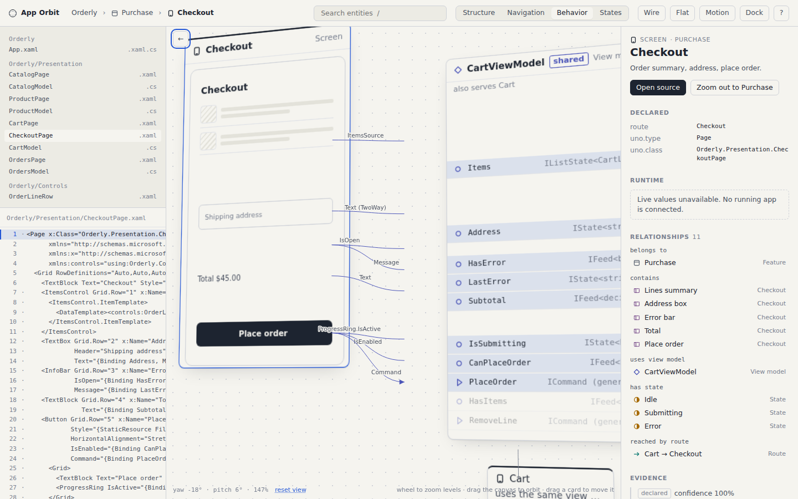

# App Orbit

A spatial app inspector prototype. It reads a structured **app graph** (screens,
components, view models, members, routes, states and the relationships between
them) and makes it explorable: semantic zoom from the whole application down to
a single property, an orbital viewer that separates a screen into its UI,
behaviour, states and connections, a mock editor that stays in sync, and an
inspector that shows declared facts, evidence and source references.

The sample app is **Orderly**, a five-screen Uno Platform ordering app
described by a hand-authored graph. No repository analysis yet; the point of
this version is to validate the interaction before investing in extraction.



## Run it

The page uses ES modules and fetches the graph as JSON, so it needs an HTTP
origin.

```powershell
.\serve.ps1          # Windows: serves on :8787 and opens the browser
```

```sh
./serve.sh           # macOS / Linux
```

Then open <http://localhost:8787/index.html>.

## The success test

Someone who has never seen Orderly should be able to answer, without reading a
file tree:

1. Which view model controls **Checkout**? Select Checkout, press `3`
   (Behavior). The plane behind the screen is `CartViewModel`, tagged *shared*
   because Cart uses it too.
2. Where does **Place order** navigate? Select the button in the preview,
   press `2` (Navigation). The chip on the right reads *Orders · on success*.
3. Where is **OrderLineRow** used? Type it in search, press Enter. The
   definition view shows the three screens with the instance highlighted on each.

Then the deeper journey: Place order → `3` → `CanPlaceOrder` → **Open source**
lands on `CartModel.cs:20`, with the three members it reads and the
*Disabled* state it drives. Set a workspace root in the `?` sheet and the
inspector adds an **Open in VS Code** link (`vscode://file/…:line`) beside it.

## What is here

```
index.html                  shell: mock editor · viewer · inspector
css/app-orbit.css           tokens (light + dark), scene, cards, previews
js/
  store.js                  one state object, one dispatch
  graph.js                  load, index and query the graph
  layout.js                 (focus, lens, view, mode) → cards + links
  scene.js                  CSS 3D layers, camera, SVG connectors, input
  preview.js                wireframe screen previews from the graph
  inspector.js              details, runtime line, relationships, evidence
  editor.js                 mock editor, line ↔ entity sync
  main.js                   boot, breadcrumb, search, keyboard
graph/
  app-graph.schema.json     the graph format (extends design-graph-kit)
  orderly.graph.json        the sample: 73 nodes, 118 edges, 11 source excerpts
scripts/validate_graph.py   integrity checks (stdlib only)
tests/smoke.mjs             Playwright journey test, writes tests/screenshots/
SPEC.md                     architecture, design, interaction and spec-graph briefs
```

## Interaction model

| Level | What you see |
|------|------|
| Application | feature plates with screen thumbnails, the entry point |
| Feature | screen previews, routes between them, in/out routes as chips |
| Screen | the preview in front; behind it the view model with members aligned to the UI rows they drive; beside it the states; around it the routes |
| Component | the host screen with everything else receded; bindings, commands, definition and other uses, states that affect it |
| Detail | a member, state or route with its consumers, dependencies, transitions and the screen that gives it context |

Lenses (`1`–`4`) choose which relationships render: Structure, Navigation,
Behavior, States. The front layer stays, so the app remains spatially
recognisable.

- Wheel zooms continuously; past a threshold over a card it zooms into that
  card, past the lower threshold it zooms out to the parent.
- Drag orbits (clamped to ±40° yaw, ±22° pitch). `0` resets.
- `W` toggles preview fidelity: wireframe (hairlines and bars) or UI (the
  sample app's own content and accent, authored in the graph as `items` and
  `text` on preview parts).
- Drag a card to move it. Positions are remembered per view in this browser;
  *reset layout* puts them back. Drag the empty canvas to orbit.
- `F` toggles the flat view: same cards, same connectors, no rotation.
- `D` docks the viewer into a small panel over the editor. Focus and camera
  are kept.
- Reduced motion is honoured from the OS and can be toggled.
- Every card is keyboard reachable: `Tab`, `Enter` to zoom in, `−` to zoom
  out, `Alt+←` to go back along your trail. `?` lists the rest.

## The graph

`graph/app-graph.schema.json` describes entities and relationships. Two
distinctions the viewer relies on:

- **Definitions versus instances.** `component.order-line-row` is one node;
  its three appearances are `component-instance` nodes linked by
  `instance-of`. You can inspect one instance or find every use.
- **Declared versus observed.** Every node and edge carries `evidence` with a
  kind (`observed`, `declared`, `derived`, `inferred`), a confidence and a
  source reference into `files[]`. Inferred edges render dashed and are
  tagged in the inspector with their rationale. Orderly has one on purpose
  (`CartCount depends-on Items`, via a shared service).

Validate a graph:

```sh
python scripts/validate_graph.py graph/orderly.graph.json
```

## Tests

```sh
npm i -D playwright            # once; or point PLAYWRIGHT_MODULE at a global install
npm run serve                  # in one terminal
npm test                       # in another: 44 checks across the three journeys
```

## Deliberately out of scope

Editing, agent-driven changes, repository extraction, a live runtime
connection (the inspector marks live values unavailable), execution traces,
automatic discovery of states. See `SPEC.md` for the open questions.
