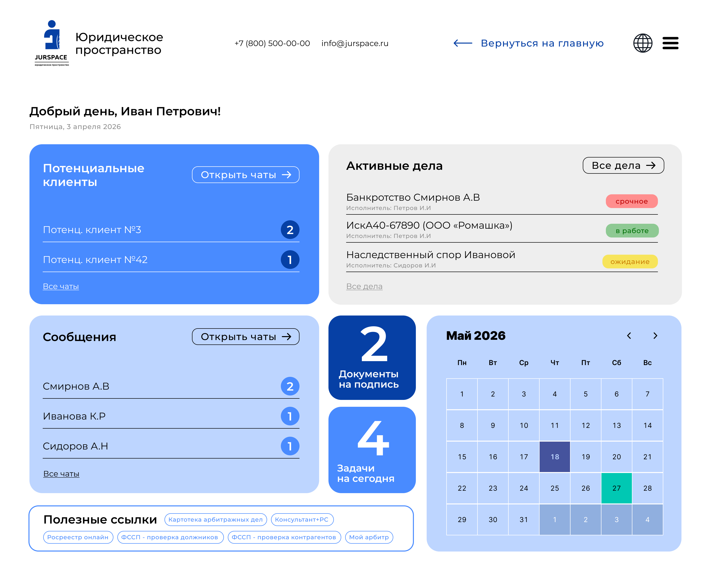

# Building a UI with Visual Parity using the Uno Platform MCPs

> A hands-on tutorial: go from a **static design mockup** to a **working, best-practice
> Uno Platform app** by letting an AI agent (Claude Code) drive the **Uno MCP** and the
> **App MCP** in a tight *build → screenshot → compare → refine* loop.

**Worked example:** the *JurSpace* ("Юридическое пространство") legal case-management
dashboard shown below. We use it as the *target design* and iterate until the running
app matches it pixel-for-pixel.



---

## Table of contents

1. [What "visual parity" means and why two MCPs](#1-what-visual-parity-means-and-why-two-mcps)
2. [Prerequisites](#2-prerequisites)
3. [Part 1 — Wire up the two Uno MCPs in Claude Code](#part-1--wire-up-the-two-uno-mcps-in-claude-code)
4. [Part 2 — Give the agent the target design](#part-2--give-the-agent-the-target-design)
5. [Part 3 — Scaffold a best-practice app (Uno MCP)](#part-3--scaffold-a-best-practice-app-uno-mcp)
6. [Part 4 — Run the app so the App MCP can see it](#part-4--run-the-app-so-the-app-mcp-can-see-it)
7. [Part 5 — The visual-parity loop (the core)](#part-5--the-visual-parity-loop-the-core)
8. [Part 6 — Layer in best practices](#part-6--layer-in-best-practices)
9. [Part 7 — Final parity check & wrap-up](#part-7--final-parity-check--wrap-up)
10. [Screenshot checklist](#screenshot-checklist)
11. [Appendix A — MCP tool reference](#appendix-a--mcp-tool-reference)
12. [Appendix B — Sample best-practice XAML](#appendix-b--sample-best-practice-xaml)

---

## 1. What "visual parity" means and why two MCPs

**Visual parity** is the goal of making the *running application* look like the *design*
— not "close enough in code," but verified against a real, rendered screenshot of the
real app on the real platform.

The reason this is hard with LLMs alone is that a model writing XAML is working *blind*:
it emits markup and hopes it renders correctly. Uno Platform closes that loop with **two
complementary MCP servers**, so the agent can *see* what it built and correct itself.

| MCP | Also called | Runs where | What it gives the agent |
|-----|-------------|-----------|--------------------------|
| **Uno MCP** | Remote / Docs MCP | Hosted (`https://mcp.platform.uno/v1`) | Semantic search + fetch over Uno docs, APIs, and best-practice guidance; "priming" prompts that teach the agent how Uno apps are structured. |
| **App MCP** | Local / Dev Server MCP | Locally, via the Uno Dev Server, attached to your *running* app | A live handle on the running app: **screenshots**, **visual-tree snapshots**, input simulation (click / type / key), and app lifecycle control. |

The workflow this tutorial teaches is the interplay between them:

```
          ┌─────────────────────────────────────────────────────────┐
          │                    THE PARITY LOOP                        │
          │                                                           │
   target │   1. read the design                                     │
  design ─┼─▶ 2. Uno MCP  → "how should I structure this in XAML?"    │
  (image) │   3. write / edit XAML + view models                     │
          │   4. App MCP  → uno_app_get_screenshot (see the result)  │
          │   5. compare screenshot ⇄ target design                  │
          │   6. App MCP  → uno_app_visualtree_snapshot (diagnose)   │
          │   7. Uno MCP  → best-practice fix, then GOTO 3            │
          │      … repeat until the screenshot matches the design    │
          └─────────────────────────────────────────────────────────┘
```

The Uno MCP keeps the code **correct and idiomatic**; the App MCP keeps it **visually
accurate**. Neither alone gets you there — together they produce a working app that both
*looks right* and *follows best practices*.

---

## 2. Prerequisites

- **.NET SDK** with the Uno Platform workload installed
  (`dotnet workload install uno` — or use the [`uno check`](https://aka.platform.uno/uno-check) tool to validate your environment).
- **Claude Code** (the CLI, or the VS Code / JetBrains extension). The same steps apply to
  VS Code Copilot, Codex, Cursor, etc. — only the `mcp install <client>` argument changes.
- A **desktop target** you can run locally (Windows or Skia Desktop). The App MCP attaches
  to whatever platform head you run; a desktop head is the fastest inner loop.
- The **target design** as an image file (here: `assets/01-target-design.png`).

> 💡 **Why local?** The App MCP talks to a *running process on your machine*. Screenshots
> and visual-tree snapshots require an actual rendered app, so this loop is run on a
> developer machine, not in a headless/remote sandbox.

---

## Part 1 — Wire up the two Uno MCPs in Claude Code

The Uno Dev Server ships a one-command installer that registers **both** MCP entries with
your agent using its native config format. For Claude Code it delegates to
`claude mcp add --scope project`, so the servers land in the project's `.mcp.json`.

```bash
# From your project root. Installs the Uno MCP + App MCP entries for Claude Code.
uno-devserver mcp install claude-code

# No global tool installed? Run it transiently via dnx:
dotnet dnx -y uno.devserver mcp install claude-code
```

Verify the registration and see which clients/transports were detected:

```bash
uno-devserver mcp status
```

You should see both servers listed — the **remote docs** server (HTTP transport, pointing
at `https://mcp.platform.uno/v1`) and the **local app / dev-server** server.

> 📸 **Screenshot `02-mcp-status.png`** — capture the terminal output of
> `uno-devserver mcp status` showing both Uno MCP entries as *detected/registered* for the
> `claude-code` client. This proves the setup step to your readers.

Confirm from inside Claude Code that the tools are available:

```
/mcp
```

> 📸 **Screenshot `03-claude-mcp-list.png`** — Claude Code's `/mcp` view listing the Uno
> servers and their tools (`uno_platform_docs_search`, `uno_app_get_screenshot`, …). See
> [Appendix A](#appendix-a--mcp-tool-reference) for the full tool list.

Finally, **prime the agent**. This is the single most valuable habit: it loads Uno's rules
so every later suggestion is idiomatic instead of generic XAML.

```
Run uno_platform_agent_rules_init and uno_platform_usage_rules_init, then confirm
you'll search the Uno Platform docs before proposing UI or API changes.
```

---

## Part 2 — Give the agent the target design

Drop the design image into the conversation and state the intent plainly. Be explicit that
**parity is verified with the App MCP**, not assumed.

> **Prompt to the agent:**
>
> "Here is the target design (`assets/01-target-design.png`) — the *JurSpace* legal
> dashboard. Build this as an Uno Platform page. Work in a loop: after each change, use
> `uno_app_get_screenshot` to capture the running app, compare it against the design, and
> keep refining until they match. Use the Uno docs MCP to choose idiomatic controls and
> layouts. Follow Uno best practices (theme resources, responsive layout, MVUX)."

Have the agent **read the design out loud** first — it forces an explicit inventory before
any code is written and gives you a checklist to verify parity against:

- **App bar:** logo + wordmark "Юридическое пространство", phone, email, a "← Вернуться на
  главную" back link, language/globe icon, hamburger menu.
- **Greeting block:** "Добрый день, Иван Петрович!" + localized date "Пятница, 3 апреля 2026".
- **Card grid** (responsive, ~2 columns of cards + a middle rail):
  - *Потенциальные клиенты* — royal-blue card, "Открыть чаты →", list of leads with count badges.
  - *Активные дела* — light-grey card, cases with status pills (`срочное`/red, `в работе`/green, `ожидание`/yellow).
  - *Сообщения* — light-blue card, contacts with unread-count badges.
  - Two **stat tiles** — "2 Документы на подпись" (navy), "4 Задачи на сегодня" (blue).
  - **Calendar** — "Май 2026" month grid with prev/next and highlighted days (18 navy, 27 teal).
  - *Полезные ссылки* — pill-shaped link chips.

> 📸 **Screenshot `04-agent-design-readout.png`** — the agent's structured breakdown of the
> design. This is your parity checklist for the rest of the tutorial.

---

## Part 3 — Scaffold a best-practice app (Uno MCP)

Let the Uno MCP create a correctly-configured solution rather than hand-rolling one. In
Claude Code, the Uno MCP exposes a `/new` prompt for this; it wires up the recommended
project structure, theming, and DI out of the box.

> **Prompt:** "Use the Uno `/new` prompt to scaffold a cross-platform app named `JurSpace`
> targeting Desktop + WebAssembly, with the Material theme and MVUX enabled."

If you prefer the CLI, the equivalent is:

```bash
dotnet new install Uno.Templates
dotnet new unoapp -o JurSpace -preset recommended
```

Ask the Uno MCP *why* it made each choice — it will cite the docs it fetched
(`uno_platform_docs_fetch`), which is exactly the "follows best practices" behavior we want:

> **Prompt:** "Before writing any UI, search the Uno docs for the recommended way to build
> a responsive dashboard layout and a reusable card style. Summarize with links."

> 📸 **Screenshot `05-scaffold-and-docs.png`** — the freshly scaffolded solution tree beside
> the agent's doc citations for the layout approach.

---

## Part 4 — Run the app so the App MCP can see it

The App MCP can only screenshot a **running** app. Launch a desktop head and confirm the
Dev Server is attached.

```bash
dotnet run --project JurSpace/JurSpace --framework net9.0-desktop
```

Then confirm the App MCP is connected:

> **Prompt:** "Call `uno_health` and `uno_app_get_runtime_info` — is the app attached, and
> what platform is it running on?"

A healthy response reports the app PID, OS, and Uno platform info. Now take the **baseline**
screenshot — the empty/default page — so you have a "before" to iterate from:

> **Prompt:** "Call `uno_app_get_screenshot` and show me the current state of the app."

> 📸 **Screenshot `06-baseline-app.png`** — the default scaffolded app as returned by
> `uno_app_get_screenshot`. This is iteration 0.

> 💡 With **Hot Reload** active, most XAML edits reflect in the running app in seconds — so
> the agent can screenshot again immediately without a rebuild, making the parity loop fast.

---

## Part 5 — The visual-parity loop (the core)

This is the heart of the tutorial. Each **iteration** is: *edit → screenshot → compare →
diagnose → fix.* Do it in slices (structure first, then components, then polish) so each
screenshot isolates one kind of change.

### Iteration 1 — Page skeleton

> **Prompt:** "Lay out the top-level structure only: an app bar row, a greeting row, and a
> responsive content grid with placeholders for each card region. Then
> `uno_app_get_screenshot` and compare the *proportions and regions* to the target — ignore
> colors and content for now."

Compare the screenshot's **grid regions** against the design. When the agent gets a
placement wrong (a common first-pass error is cards stacking instead of gridding), have it
diagnose structurally rather than guess:

> **Prompt:** "The right column isn't aligning. Call `uno_app_visualtree_snapshot` and tell
> me the actual `Grid.Row`/`Grid.Column` and `Width`/`Height` each region resolved to versus
> what you intended."

The visual-tree snapshot is text, so the agent can reason about *actual* resolved layout
instead of re-reading its own XAML. This is what makes the correction reliable.

> 📸 **Screenshot `07-iter1-skeleton.png`** — side by side: app screenshot (regions blocked
> out) next to the target. Annotate any region that's still misplaced.

### Iteration 2 — Components and content

Fill each region: the leads list, the active-cases list with status pills, the messages
list with count badges, the two stat tiles, the calendar grid, and the link chips. Prefer
**data-driven** controls (`ItemsRepeater`/`ListView` over hand-copied rows) — see
[Appendix B](#appendix-b--sample-best-practice-xaml).

> **Prompt:** "Build each card's content with data-bound item templates, not static copies.
> Screenshot after each card and compare that card to the design before moving on."

> 📸 **Screenshots `08-iter2-cards-*.png`** — one capture per card as it lands, each paired
> with the corresponding crop of the target.

### Iteration 3 — Color, type, spacing

Now chase pixel parity: the royal-blue / navy / light-blue card fills, the red/green/yellow
status pills, the teal calendar highlight, font weights, corner radii, and padding.

> **Prompt:** "Compare the latest `uno_app_get_screenshot` to the target and list every
> visual difference you can see — fill color, corner radius, font weight, spacing, badge
> color. Fix them via **theme resources**, not inline literals, then screenshot again."

Repeat until the differences the agent reports are empty. A good agent will converge in a
few passes; each pass is anchored by a real screenshot, so it can't fool itself.

> 📸 **Screenshots `09-iter3-parity-a.png` / `09-iter3-parity-b.png`** — an early-pass and a
> converged-pass capture next to the target, to show the loop actually closing.

---

## Part 6 — Layer in best practices

Parity is necessary but not sufficient — the point of the two MCPs is to reach parity
*with* clean code. Have the agent verify each item against the Uno docs MCP:

- **Theme resources & Design System** — colors, brushes, corner radii, and text styles live
  in resource dictionaries (`ColorPaletteOverride.xaml`, theme resources), never as inline
  literals. Ask: *"Search the docs for the recommended way to override the Material color
  palette and move every hard-coded brush into resources."*
- **Responsive layout** — the design is desktop-wide; use `VisualStateManager` /
  `AdaptiveTrigger` so the card grid reflows to one column on narrow widths. Screenshot at
  two window sizes with the App MCP to prove it.
- **MVUX / MVVM** — the greeting, lists, badges, and calendar bind to a view model / model,
  not code-behind. This is what makes the "2", "4", and unread counts real.
- **Localization** — the UI is Russian; strings belong in `Strings/*/Resources.resw`, and
  the date ("Пятница, 3 апреля 2026") uses culture-aware formatting.
- **Accessibility** — automation names on the icon buttons; sufficient contrast on the
  status pills. The App MCP's `uno_app_visualtree_snapshot` and
  `uno_app_element_peer_default_action` let the agent confirm elements are reachable.

> 📸 **Screenshot `10-responsive-narrow.png`** — `uno_app_get_screenshot` at a narrow window
> width, showing the grid reflowed to a single column. Proof the layout is responsive, not
> just fixed to match one screenshot.

---

## Part 7 — Final parity check & wrap-up

Do a last, explicit comparison and record it:

> **Prompt:** "Take a final `uno_app_get_screenshot`. Go through the parity checklist from
> Part 2 item by item and mark each ✅/❌ against the target. For anything ❌, fix and
> re-screenshot."

> 📸 **Screenshot `11-final-parity.png`** — the finished app next to the target design, with
> the checklist all green. This is the money shot of the tutorial.

**What the reader just learned:**

- The **Uno MCP** turns "write some XAML" into "write *idiomatic, documented* XAML."
- The **App MCP** turns "I think it looks right" into "here is a screenshot proving it does."
- Together they form a **closed loop** where the agent *sees its own output* and self-
  corrects to visual parity — the same way a human developer alt-tabs between the design and
  the running app, but automated.

---

## Screenshot checklist

Capture these as you go and drop them in `assets/` with the names below. Only
`01-target-design.png` ships in this repo; the rest are produced live on your machine while
running the loop.

| File | Step | What it shows |
|------|------|---------------|
| `01-target-design.png` | Intro | The target design (included). |
| `02-mcp-status.png` | Part 1 | `uno-devserver mcp status` — both MCPs registered. |
| `03-claude-mcp-list.png` | Part 1 | Claude Code `/mcp` listing the Uno tools. |
| `04-agent-design-readout.png` | Part 2 | Agent's structured design breakdown. |
| `05-scaffold-and-docs.png` | Part 3 | Scaffolded solution + doc citations. |
| `06-baseline-app.png` | Part 4 | Iteration 0 — default running app. |
| `07-iter1-skeleton.png` | Part 5 | Layout regions vs. target. |
| `08-iter2-cards-*.png` | Part 5 | Each card vs. its target crop. |
| `09-iter3-parity-a/b.png` | Part 5 | Loop converging on colors/type. |
| `10-responsive-narrow.png` | Part 6 | Reflowed single-column layout. |
| `11-final-parity.png` | Part 7 | Finished app vs. target, checklist green. |

> **How to insert a screenshot in Markdown:** ``.
> When capturing via the App MCP, ask the agent to *save* the screenshot to the `assets/`
> folder with the target filename so it lands ready to embed.

---

## Appendix A — MCP tool reference

### Uno MCP (remote docs server)

| Tool | Purpose |
|------|---------|
| `uno_platform_docs_search` | Semantic search across Uno docs, APIs, guides. |
| `uno_platform_docs_fetch` | Retrieve a specific document (markdown, with code). |
| `uno_platform_agent_rules_init` | Prime the agent on how to build Uno apps. |
| `uno_platform_usage_rules_init` | Prime the agent on API best practices. |

### App MCP (local dev-server server)

| Tool | Purpose |
|------|---------|
| `uno_health` | Dev Server health / connection status. |
| `uno_app_get_runtime_info` | App PID, OS, platform info. |
| `uno_app_get_screenshot` | **Capture a screenshot of the running app.** |
| `uno_app_visualtree_snapshot` | Textual snapshot of the live visual tree. |
| `uno_app_pointer_click` | Click at (X, Y). |
| `uno_app_key_press` | Press keys with modifiers. |
| `uno_app_type_text` | Type a text string. |
| `uno_app_element_peer_default_action` | Invoke an element's default action. |
| `uno_app_start` / `uno_app_close` | Manage app lifecycle. |
| `uno_app_element_peer_action` *(Pro)* | Invoke a specific automation-peer action. |
| `uno_app_get_element_datacontext` *(Pro)* | Read an element's DataContext. |

> Tool availability depends on your Uno license tier (Community vs. Pro). Names reflect the
> Uno Dev Server MCP as of this writing — run `/mcp` in Claude Code to see the exact set for
> your version.

---

## Appendix B — Sample best-practice XAML

Illustrative snippets the agent should converge on — **data-driven, resource-themed,
responsive** — not hand-copied rows with inline colors. Treat these as reference targets for
what "follows best practices" looks like for this design.

**Theme resources (in a `ResourceDictionary`), not inline literals:**

```xml
<ResourceDictionary xmlns="http://schemas.microsoft.com/winfx/2006/xaml/presentation"
                    xmlns:x="http://schemas.microsoft.com/winfx/2006/xaml">
    <!-- JurSpace palette -->
    <Color x:Key="BrandBlue">#2F6BFF</Color>
    <Color x:Key="BrandNavy">#0B1F5B</Color>
    <Color x:Key="BrandLightBlue">#DCE7FF</Color>
    <Color x:Key="BrandTeal">#12B886</Color>
    <SolidColorBrush x:Key="CardBrandBrush" Color="{StaticResource BrandBlue}" />
    <SolidColorBrush x:Key="CardMessagesBrush" Color="{StaticResource BrandLightBlue}" />

    <!-- Status pill colors -->
    <SolidColorBrush x:Key="StatusUrgentBrush" Color="#F28B82" />   <!-- срочное -->
    <SolidColorBrush x:Key="StatusInWorkBrush" Color="#7FD99A" />   <!-- в работе -->
    <SolidColorBrush x:Key="StatusWaitingBrush" Color="#F5D547" />  <!-- ожидание -->

    <!-- Reusable card style -->
    <Style x:Key="DashboardCard" TargetType="Border">
        <Setter Property="CornerRadius" Value="20" />
        <Setter Property="Padding" Value="28" />
    </Style>
</ResourceDictionary>
```

**Responsive card grid with `AdaptiveTrigger` (desktop-wide → single column):**

```xml
<Grid x:Name="ContentGrid" ColumnSpacing="24" RowSpacing="24">
    <Grid.ColumnDefinitions>
        <ColumnDefinition Width="*" />
        <ColumnDefinition Width="*" />
    </Grid.ColumnDefinitions>

    <VisualStateManager.VisualStateGroups>
        <VisualStateGroup>
            <VisualState>
                <VisualState.StateTriggers>
                    <AdaptiveTrigger MinWindowWidth="0" />
                </VisualState.StateTriggers>
                <VisualState.Setters>
                    <!-- collapse to one column on narrow screens -->
                    <Setter Target="ContentGrid.(Grid.ColumnDefinitions)[1].Width" Value="0" />
                </VisualState.Setters>
            </VisualState>
            <VisualState>
                <VisualState.StateTriggers>
                    <AdaptiveTrigger MinWindowWidth="900" />
                </VisualState.StateTriggers>
            </VisualState>
        </VisualStateGroup>
    </VisualStateManager.VisualStateGroups>

    <!-- cards go here -->
</Grid>
```

**Data-driven "Active cases" card (bind, don't copy):**

```xml
<Border Style="{StaticResource DashboardCard}" Background="{ThemeResource NeutralCardBrush}">
    <StackPanel Spacing="16">
        <Grid>
            <TextBlock Text="Активные дела" Style="{StaticResource TitleTextBlockStyle}" />
            <Button Content="Все дела →" HorizontalAlignment="Right" />
        </Grid>

        <ItemsControl ItemsSource="{Binding ActiveCases}">
            <ItemsControl.ItemTemplate>
                <DataTemplate>
                    <Grid Padding="0,12" ColumnSpacing="12">
                        <Grid.ColumnDefinitions>
                            <ColumnDefinition Width="*" />
                            <ColumnDefinition Width="Auto" />
                        </Grid.ColumnDefinitions>
                        <StackPanel>
                            <TextBlock Text="{Binding Title}" />
                            <TextBlock Text="{Binding Assignee}" Opacity="0.6"
                                       Style="{StaticResource CaptionTextBlockStyle}" />
                        </StackPanel>
                        <!-- StatusBrush comes from a converter mapping status → brush resource -->
                        <Border Grid.Column="1" CornerRadius="12" Padding="12,4"
                                Background="{Binding Status, Converter={StaticResource StatusToBrush}}">
                            <TextBlock Text="{Binding StatusLabel}" />
                        </Border>
                    </Grid>
                </DataTemplate>
            </ItemsControl.ItemTemplate>
        </ItemsControl>
    </StackPanel>
</Border>
```

The agent should reach code like this **because the Uno MCP told it to** (resource theming,
adaptive triggers, data binding are all in the docs) and confirm it **looks right because
the App MCP screenshotted it** — that is visual parity with best practices, which is the
whole point.

---

### Sources & further reading

- Uno Platform MCP overview — <https://platform.uno/mcp/>
- Using the Uno MCPs (official docs) — <https://github.com/unoplatform/uno/blob/master/doc/articles/features/using-the-uno-mcps.md>
- Hot Design (runtime visual designer) — <https://platform.uno/hot-design/>
- MCP configuration across AI agents — <https://platform.uno/blog/mcp-configuration-across-ai-agents/>
- Uno Platform Studio — <https://platform.uno/studio/>
